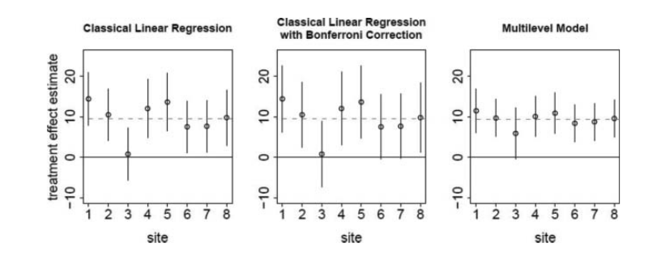

I want to try to summarise an idea exposed on [this
paper](http://www.stat.columbia.edu/~gelman/research/published/multiple2f.pdf)
from Gelman,  Hill and Yajima which addresses an issue that is extremely
frequent: the [multiple comparisons
problem](https://en.wikipedia.org/wiki/Multiple_comparisons_problem). I
strongly recommend reading the paper.

The problem of Type I error (i.e. getting false positive effects) when many
comparisons are performed is widely known by statisticians: if you run 100
tests at a 5% significance level, by chance you'll get about five comparisons
that are significant even if there's no true effect and the chances that you
get at least one false positive is 99.4%.

There are some simple ways to address this situation like the [Bonferroni
correction](https://en.wikipedia.org/wiki/Bonferroni_correction) of the
p-values which does it at the expense of the Type II error (increase in false
negatives). There are more complex and accurate options for example using the
[false discovery
rate](https://en.wikipedia.org/wiki/False_discovery_rate#Controlling_procedures)
type of methods by controlling the expected proportion of false positives.

The paper approaches the problem from a complete different angle: with
hierarchical/multilevel modelling within the Bayesian paradigm. It compares the
classical methods of adjustment with a better modelling solution, "rather than
correcting for a perceived problem, we just build the multiplicity into the
model from the start".

The idea is simple, instead of modelling each comparison separately we model
them all together. Then the estimates and intervals shrink or are pulled
towards a common behaviour depending on their relative weight, depending on the
amount of information we have about them in relation to the others.

The paper includes a few very clear examples that illustrate the type of issues
that we commonly face. The first one, summarised in the image below, is a
comparison of intervals for the mean effect of a treatment in eight different
schools using no correction, the Bonferroni correction and a multilevel model.
It's obvious how much smaller is the variability of the estimates in the latter
option, and that's because they're using the information from **all** the
schools.

The second example shows a pairwise comparison of test scores for all US
states. By chance some should be significant but a multilevel model ensures
we're using all the information available. It's worth mentioning that the prior
distribution of the parameters is uniform, which means the Bayesian model is
not assuming more prior knowledge than its classical counterpart.

In their words:

> A multilevel model (...) recognizes that this site-specific estimate is
> actually ignoring some important information — the information provided by
> the other sites. While still allowing for heterogeneity across sites, the
> multilevel model also recognizes that because all the sites are measuring the
> same phenomenon it does not make sense to completely ignore what has been
> found in the other sites. Therefore each site-specific estimate gets “shrunk”
> or pulled toward the overall estimate (or, in a more general setting, toward
> a group-level regression fit).  

> The greater the uncertainty in a site, the more it will get pulled toward the
> overall estimate. The less the uncertainty in a site, the more we trust that
> individual estimate and the less it gets shrunk.

I personally love the idea as it seems a lot more intuitive than the usual null
hypothesis statistical testing (NHST) approach which has, in recent years,
started falling apart, slowly but steadily
[with many people questioning their
usefulness](http://civilstat.com/2013/01/hypothesis-tests-will-not-answer-your-question/).

A crucial aspect of the criticism to the classical approach and to NHST in
particular, is the fact that we would rarely expect that a parameter is exactly
zero or in general that the null hypothesis is always true or false.

> (...) most classical multiple comparisons adjustments, such as the FDR
> adjustment (...), will not be appropriate, because we know ahead of time that
> the null hypothesis
(zero average differences between states) is false, so there is no particular
reason to worry
about the Type 1 error rate (...)

One of the aspects I like about Bayesian statistics is that it embraces
uncertainty. Instead of assuming that there is a truth with no uncertainty we
assume and try to understand the underlying uncertainty.

Real life examples are nice to have, but I'm more and more in favour of showing
the validity of methods and techniques by simulating a situation and then
showing that the method actually extracts the information we want to understand
from the data accurately. As I said, the paper has quite a few very nice
examples that I'm planning to reproduce with Stan, and would be happy to
discuss in one of our next code clubs. Here there's an example that A. Gelman
created for [this
post](http://andrewgelman.com/2016/08/22/bayesian-inference-completely-solves-the-multiple-comparisons-problem/)
(which I've [refactored a
bit](https://github.com/iwi/multi-comparisons-classical-bayesian/blob/master/multiple_comparison_simulation.R)
to my style preferences), that shows a comparison between the frequentist and
the Bayesian intervals when looking at multiple comparisons using a simulated
example.

Just to give some context on the relevance of the subject, even if the paper I
suggest reading is from 2011, [it was being discussed just a few days
ago](http://andrewgelman.com/2017/07/25/multilevel-modeling-can-cannot/), and
it's not really new like [this paper from
1991](https://errorstatistics.files.wordpress.com/2016/06/greenland-robins-1991-eb-multiple-comp-epidemiol.pdf)
shows.
)

